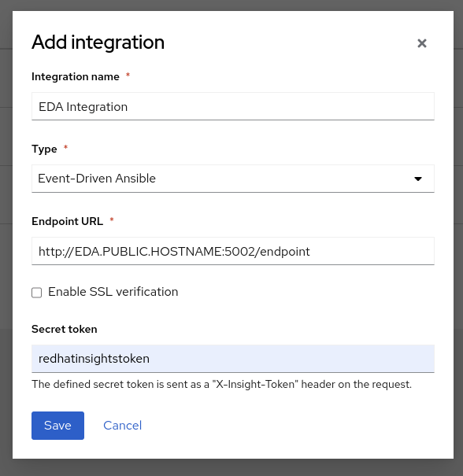

# Insights EDA integration

This use case shows how Event Driven Automation can be integrated with [Red Hat Insights](https://console.redhat.com/insights/dashboard).

Using native integration, it is possible to configure [Event Driven Automation destination](https://console.redhat.com/settings/integrations).

Note that you will need a public reachable URL/IP to be able to receive events coming from Insights.

You can use [ngrok](https://ngrok.com/) to set-up a temporary public address to use for the use case.

## Resolve a recommendation using Insights and EDA

The setup will configure a playbook you can use to simulate a recommendation on Insights, in our case it will trigger a suggestion to disable SSH Root Login on a RHEL machine.

In order to replicate this use case, you will need to:

- have a RHEL Machine up and running
- a service user with sudo privileges on the machine with **sysadmin/redhat** credentials
- [edit the inventory accordingly](../../inventory)

The machine needs to be reachable from the EDA Controller.

### Configuration

In order to run these use cases, setup scripts [are available here](../../eda-demo-setup/):

    ansible-playbook configure-use-case.yml -e @use-cases/use-case-insights-setup.yml

On AAP Controller, it will create a Job Template called **[EDA] Insights - Generate recommendation** that you can run against your machine to generate the recommendation, and wait a few seconds before the event is triggered and handled.

EDA Controller will then run a Job Template to remediate the recommendation and you will receive soon the resolution notification.
