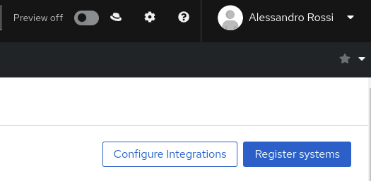
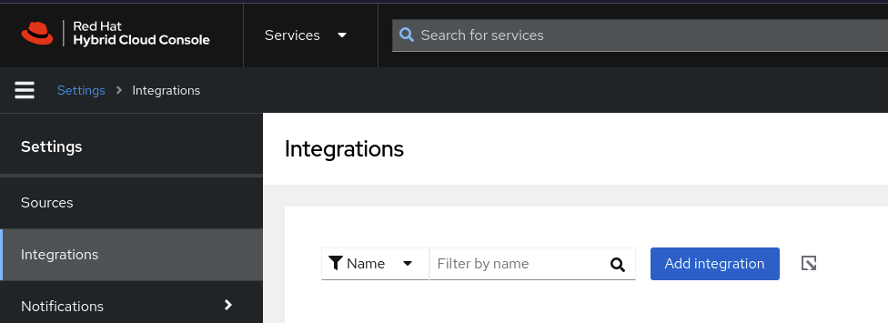
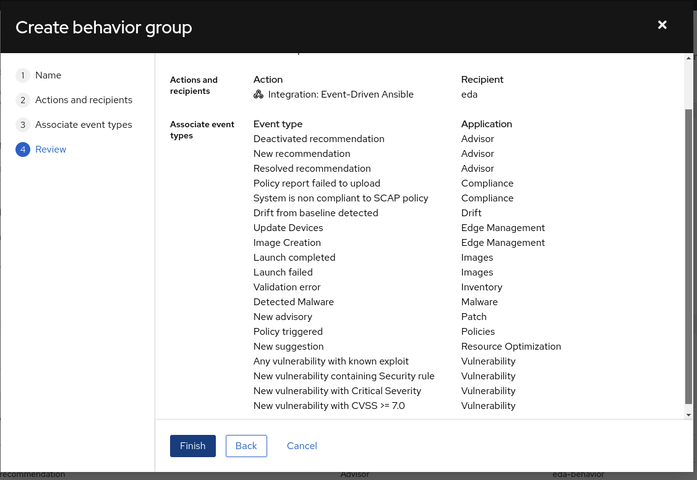

# Insights EDA integration

This use case shows how Event Driven Automation can be integrated with [Red Hat Insights](https://console.redhat.com/insights/dashboard).

Using native integration, it is possible to configure [Event Driven Automation destination](https://console.redhat.com/settings/integrations).


**Note that you will need a public reachable URL/IP to be able to receive events coming from Insights.**

## Configuration

### Ngrok

You can use [ngrok](https://ngrok.com/) to set-up a temporary public address to use for the use case. Follow the instructions on the site to get a free address to use for your EDA Controller machine.

### Red Hat Insights

To config Red Hat Insights for EDA integration, from the [Red Hat Insights Dashboard](https://console.redhat.com/insights/dashboard):

1. go on _Configure Integrations_ and add a new integration:




2. Fill the fields ensuring you use **redhatinsightstoken** as the _Secret token_ to match the rulebook configuration.


Now configure the notifications, to do so:

1. Go on the [Notification Settings](https://console.redhat.com/settings/notifications/rhel)
2. Create a new notification Group that uses the _Integration: Event-Driven Ansible_ created before at point 2) and notifies about ALL the events:



Verify from the [Integrations Settings](https://console.redhat.com/settings/integrations) that the connection is successful.

### Service Now

Before running the configuration, ensure you follow the instructions to create a [Service Now instance](https://developer.servicenow.com/). It will take 5 minutes and you will have a working instance in minutes.

### Run the configuration on AAP2 Controller and EDA Controller

Configure the following variables in [the common variables file](../../eda-demo-setup/vars/common_vars.yml) with your Red Hat Credentials and Service Now Credentials, as they will be used to configure them on the AAP2 Controller to interact with Insights and SNOW:

    aap2_controller_host:
    aap2_controller_username:
    aap2_controller_password:

    eda_controller_url:
    eda_controller_user:
    eda_controller_password:

    rhsm_account_username:
    rhsm_account_password:

    servicenow_instance_url:
    servicenow_instance_user:
    servicenow_instance_password:

You can delete the unused vars.

The use case comes with a pre-configured set of playbooks, credentials and rulebooks that you can use, to create them, from the repository root:

```bash
    cd eda-demo-setup
    ansible-playbook configure-use-case.yml -e @use-cases/use-case-insights-setup.yml
```

## Use cases

### CVE and advisory remediation

This use case will react to a Red Hat Insights advisory event. The advisory for a system will report all known issues affecting a systems, any related CVE and resolution.
Once triggered, the job template will:

- Receive the information from the Red Hat Insights event
- Retrieve the list of remediation for the system
- Generate remediation playbooks for the system-
- Ensure a Red Hat Insights project and a Red Hat Insights credential exists in the AAP2 controller
- Generate a Job Template with the playbook recommendation
- Execute it on the affected system(s)

On AAP Controller, it will use a Job Template called **[EDA] Insights - Handle Advisories** that will handle the advisory event, generating a remediation and executing it against the system.

### Resolve a recommendation using Insights and EDA

The setup will configure a playbook you can use to simulate a recommendation on Insights, in our case it will trigger a suggestion to disable SSH Root Login on a RHEL machine.

In order to replicate this use case, you will need to:

- have a RHEL Machine up and running
- a service user with sudo privileges on the machine with **sysadmin/redhat** credentials
- [edit the inventory accordingly](../../inventory)

The machine needs to be reachable from the EDA Controller.

On AAP Controller, it will use the following Job Template, **[EDA] Insights - Generate recommendation** that you need to run against your machine to generate the recommendation, and wait a few seconds before the event is triggered and handled.

### Malware detection and reporting

The setup will configure a job template on AAP to simulate malware on a RHEL machine, named
The EDA rulebook detects a malware event and reports information in a Service Now Incident for further investigation.

- have a RHEL Machine up and running
- a service user with sudo privileges on the machine with **sysadmin/redhat** credentials
- [edit the inventory accordingly](../../inventory)
- a [Service Now instance](https://developer.servicenow.com/)

On AAP Controller, it will use a Job Template called **"[EDA] Insights - Configure Malware Detection"** that you can use to configure malware detection with Insights and another job template, **"[EDA] Insights - Trigger Malware"** that you can run against your machine to trigger malwared detection, and wait a few seconds before the event is triggered and handled.
