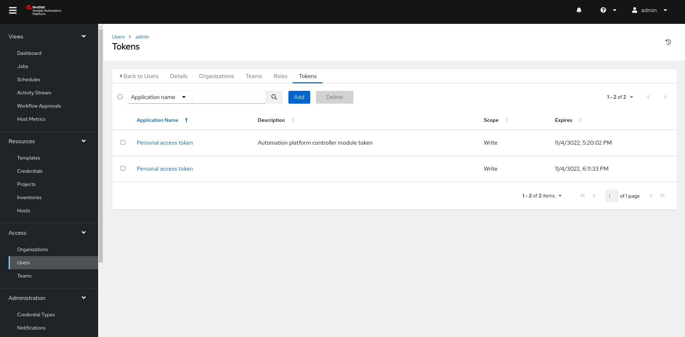
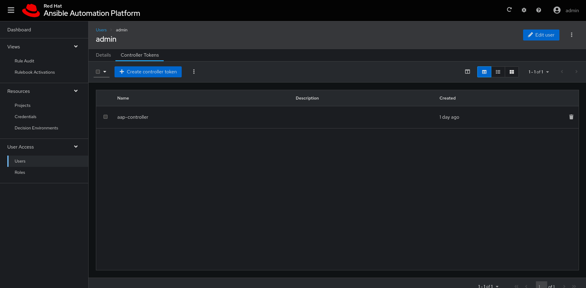

## Automation controller setup

Once your setup is in place, you need to generate a token, that will be used by EDA Controller to connect to the Automation Controller. To do so, you can go in the **Users -> admin -> Token** section in the controller and *ADD*  a new token.

Save the token and open the EDA Controller URL, go in the **Users -> admin -> Token** section and *Create controller token*

Alternatively, you can use the [configure-controller-token playbook](./eda-controller-setup/configure-controller-token.yml)

To configure the predefined project, credentials and templates, you can use the playbooks located in the [eda-controller-setup directory](./eda-controller-setup/).

The *configure-aap-controller* playbook, requires an ansible-galaxy configuration that allows accessing [Red Hat Automation Hub](https://access.redhat.com/documentation/en-us/red_hat_ansible_automation_platform/2.4/html-single/getting_started_with_automation_hub/index)

First, install the requirements:

    ansible-galaxy install -r requirements.yml

Tune up the [eda-vars.yml file](./eda-controller-setup/eda-vars.yml) to match your setup, the relevant settings (and self-explanatory) are:

    aap2_controller_host:
    aap2_controller_username:
    aap2_controller_password:

    eda_controller_url:
    eda_controller_user:
    eda_controller_password:

    servicenow_instance_url:
    servicenow_instance_user:
    servicenow_instance_password:

These variables will be used to configure both the AAP2 Controller and the EDA Controller.

You can then run the two playbooks to complete the configuration.

    ansible-playbook configure-aap-controller.yml
    ansible-playbook configure-eda-controller.yml
